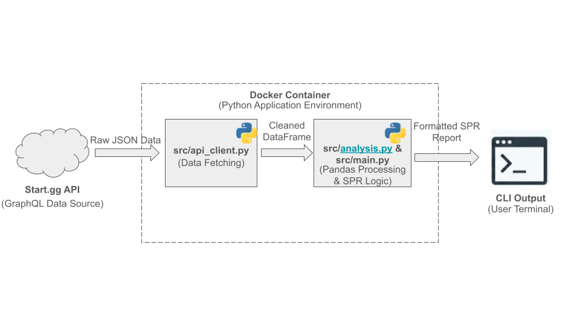

# Major Tournament Digest

## 1. Executive Summary
**Problem:** Some of the largest competitive gaming tournaments involve thousands of entrants. Commentators, journalists, and staticians alike can struggle to identify unexpectedly successful placings from "black horse" players without spending tons of time combing through the tournament's results.

**Solution:** `Major-Tournament-Digest` is a containerized Python CLI tool. It interacts with the Start.gg GraphQL API to allow users to select any double-elimination tournament on the start.gg website. It generates an automated "Deep Run Report" using a **Seed Performance Rating (SPR)** metric to identify players who statistically outperformed their projected bracket placement.

## 2. System Overview
**Course Concept:** This project implements a Data Pipeline (Weeks 3-4) within a Docker Container. It utilizes:
* **APIs:** To fetch tournament data.
* **Pandas:** To transform JSON into DataFrames and perform multi-column sorting.
* **CLI Interaction:** To accept user input for tournament slugs.

**Architecture Diagram:**


**Data Source:**
* **Source:** Start.gg GraphQL API
* **Format:** JSON (Paginated)
* **Volume:** Configurable (Standard: Top 100+ entrants per event)
* **License:** Data used in accordance with Start.gg API Terms of Service.

## 3. How to Run
**Prerequisites:** Docker installed.

**Build:**
```
bash
docker build -t tournament-digest .
```

**Run:**
`docker run -it --rm --env-file .env tournament-digest`

**Usage:**

1. Enter a Tournament Slug (e.g., `genesis-x` or `supernova-2024`).
2. Select the Event ID from the list (e.g., `[1] Ultimate Singles`).
3. View the generated SPR Report in the console.

## 4. Design Decisions
**Why SPR instead of "Seed - Placement"?** In Double Elimination brackets, placement difficulty is exponential. Placing 65th vs 49th is a skill gap equivalent to placing 2nd vs 1st. I implemented a custom `get_placement_tiers` algorithm to map raw placements to "Bracket Tiers." This ensures the analysis accurately reflects what we're setting out to evaluate.

**Interactive CLI vs. Hardcoded Script:** I chose to make the tool interactive using `input()` and dynamic API queries.
* Tradeoff: This requires the user to run Docker in interactive mode (`-it`), which is slightly more complex.
* Benefit: The tool is "Game Agnostic." It can analyze any tournament seamlessly.

## 5. Results & Evaluation
**Validation:** I validated the tool against "Genesis X" (1,500+ entrants). The tool correctly identified known outlier runs and correctly handled API pagination for large datasets.

**Output:**
```
--- Major Tournament Digest ---
Enter Tournament Slug (default: 'genesis-x'):
Looking up tournament: genesis-x...

Found Tournament: GENESIS X

Available Events:
[1] Pump It Up Speed (Pump it Up Phoenix)
[2] Classic Tetris (Tetris)
[3] Melee Singles (Super Smash Bros. Melee)
[4] Ultimate Singles (Super Smash Bros. Ultimate)
[5] Melee Doubles (Super Smash Bros. Melee)
[6] Ultimate Doubles (Super Smash Bros. Ultimate)
[7] Street Fighter 6 (Street Fighter 6)
[8] Rivals 2 Singles (Rivals of Aether II)
[9] Guilty Gear Strive (Guilty Gear: Strive)
[10] Tekken 8 (TEKKEN 8)
[11] Nick All-Star Brawl 2 Singles (Nickelodeon All-Star Brawl 2)
[12] Brawl Singles (Super Smash Bros. Brawl)
[13] Granblue Fantasy Versus: Rising (Granblue Fantasy Versus: Rising)
[14] Under Night In-Birth II Sys:Celes (Under Night In-Birth II Sys:Celes)
[15] Rivals of Aether Workshop (Rivals of Aether)
[16] Splatoon 3 (Splatoon 3)
[17] Rivals of Aether Doubles (Rivals of Aether)
[18] Rivals of Aether Singles (Rivals of Aether)
[19] DDR A20 PLUS (DanceDanceRevolution A20)
[20] DDR Extreme (Dance Dance Revolution EXTREME Pro)
[21] Guilty Gear Xrd REV2 (Guilty Gear Xrd REV2)
[22] Capcom vs SNK 2 (Capcom vs. SNK 2)
[23] maimai DX FESTiVAL (Maimai DX Festival)
[24] Super Turbo (Super Street Fighter II Turbo)
[25] SSB64 Doubles (Super Smash Bros.)
[26] Magical Drop 3 (Magical Drop III)
[27] SSB64 Singles (Super Smash Bros.)
[28] DDR A20 PLUS Freestyle (DanceDanceRevolution A20)
[29] Pump It Up Freestyle (Pump it Up Phoenix)
[30] Rivals of Aether Workshop Classic (Rivals of Aether)

Enter the number of the event to analyze: 4
Fetching data for Event ID 985242... 1.. 2.. 3.. 4.. 5.. 6.. 7.. 8.. 9.. 10.. 11.. 12.. 13.. 14.. 15.. 16..

Analyzed 1506 entrants for Ultimate Singles

--- 🚨 DEEP RUN REPORT (SPR +3 or higher) 🚨 ---
• Zomba (Seed 12)
  Placed 1 | SPR: +6
  --------------------------------
• Skeleton (Seed 168)
  Placed 17 | SPR: +6
  --------------------------------
• Peckham (Seed 137)
  Placed 25 | SPR: +5
  --------------------------------
• RVA | Money_mike (Seed 616)
  Placed 97 | SPR: +5
  --------------------------------
• BUZZ | Neo (Seed 24)
  Placed 5 | SPR: +4
  --------------------------------
• Snoop (Seed 301)
  Placed 65 | SPR: +4
  --------------------------------
• LK | Mack (Seed 651)
  Placed 129 | SPR: +4
  --------------------------------
• MattyB (Seed 906)
  Placed 193 | SPR: +4
  --------------------------------
• Stride | SHADIC (Seed 20)
  Placed 7 | SPR: +3
  --------------------------------
• KN | アカキクス (Seed 33)
  Placed 13 | SPR: +3
  --------------------------------
• Empire Gaming | Jakal (Seed 56)
  Placed 17 | SPR: +3
  --------------------------------
• Oryon (Seed 66)
  Placed 25 | SPR: +3
  --------------------------------
• [foc] | Dtier (Seed 181)
  Placed 49 | SPR: +3
  --------------------------------
• shai! (Seed 287)
  Placed 97 | SPR: +3
  --------------------------------
• NPT BCe | DanTheMan (Seed 403)
  Placed 129 | SPR: +3
  --------------------------------
• SU Esport | yamis (Seed 493)
  Placed 129 | SPR: +3
  --------------------------------
• Fire (Seed 506)
  Placed 129 | SPR: +3
  --------------------------------
• CLD | Jōkā (Seed 529)
  Placed 193 | SPR: +3
  --------------------------------
• UCLA | MoarRobots (Seed 550)
  Placed 193 | SPR: +3
  --------------------------------
• Jashan (Seed 568)
  Placed 193 | SPR: +3
  --------------------------------
• Elfy (Seed 574)
  Placed 193 | SPR: +3
  --------------------------------
• d^ | Ashen One (Seed 697)
  Placed 193 | SPR: +3
  --------------------------------
• Maddness (Seed 788)
  Placed 257 | SPR: +3
  --------------------------------
• Harloww (Seed 804)
  Placed 257 | SPR: +3
  --------------------------------
• Quotsu (Seed 968)
  Placed 257 | SPR: +3
  --------------------------------
• Nicohachi/にこはち (Seed 1088)
  Placed 385 | SPR: +3
  --------------------------------
• Senpaii (Seed 1154)
  Placed 385 | SPR: +3
  --------------------------------
• eepy | neko rebel (Seed 1353)
  Placed 385 | SPR: +3
  --------------------------------
• SpicE (Seed 1478)
  Placed 385 | SPR: +3
  --------------------------------
Report Generation Complete.
```

## 6. Future Work

**Visualization:** Integration with `matplotlib` to generate a heatmap of players.

**Export:** Option to save the report to a CSV file.